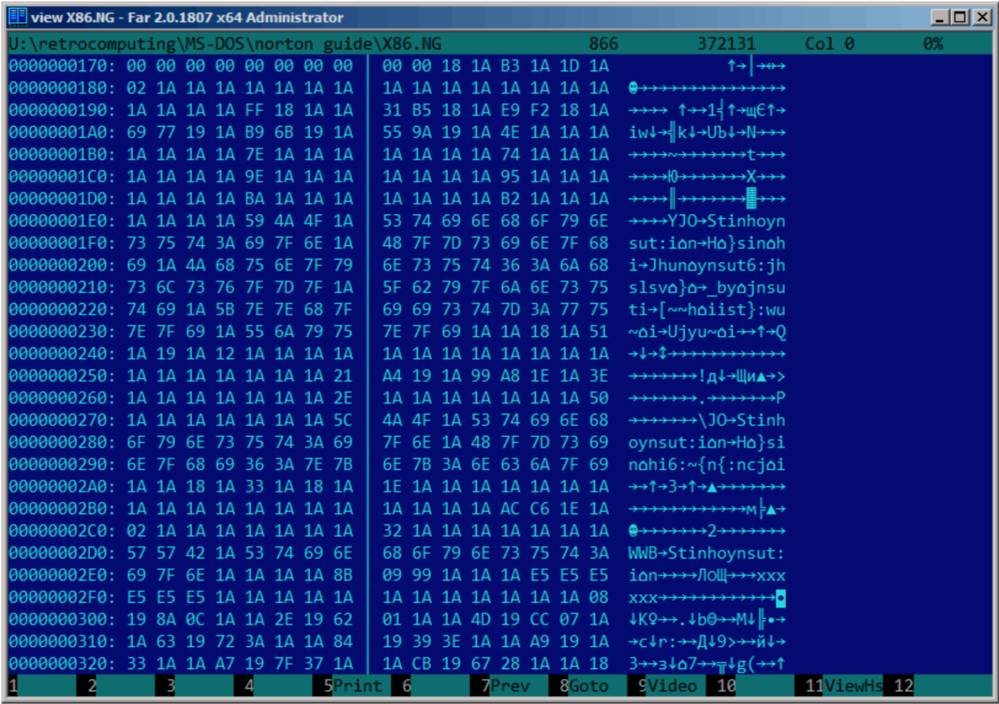
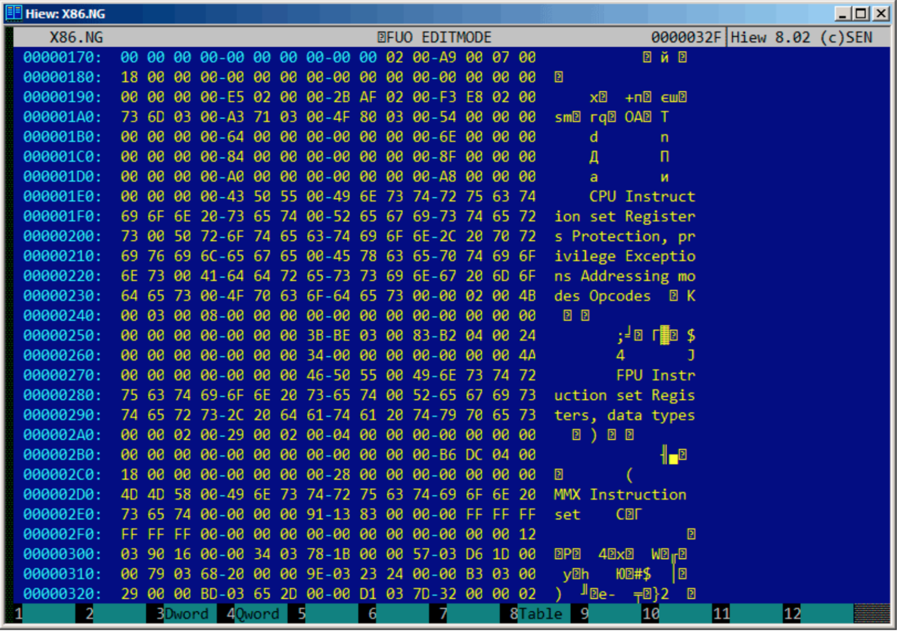
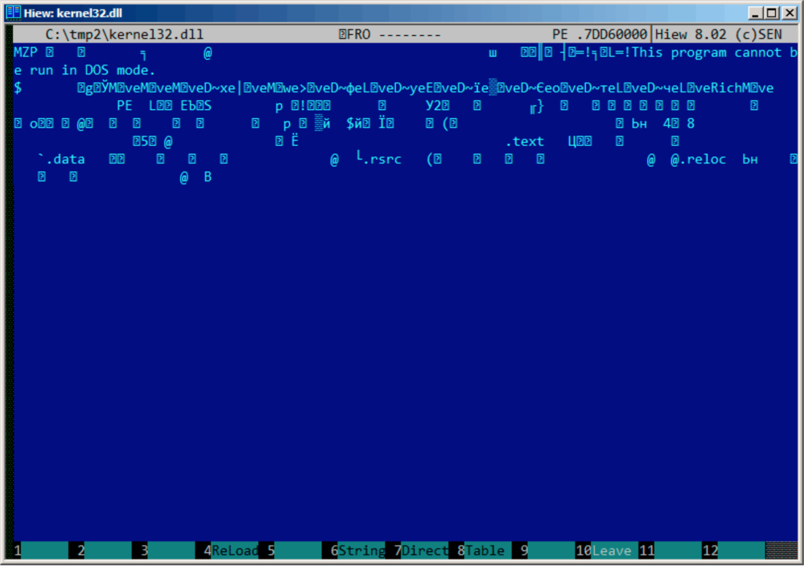
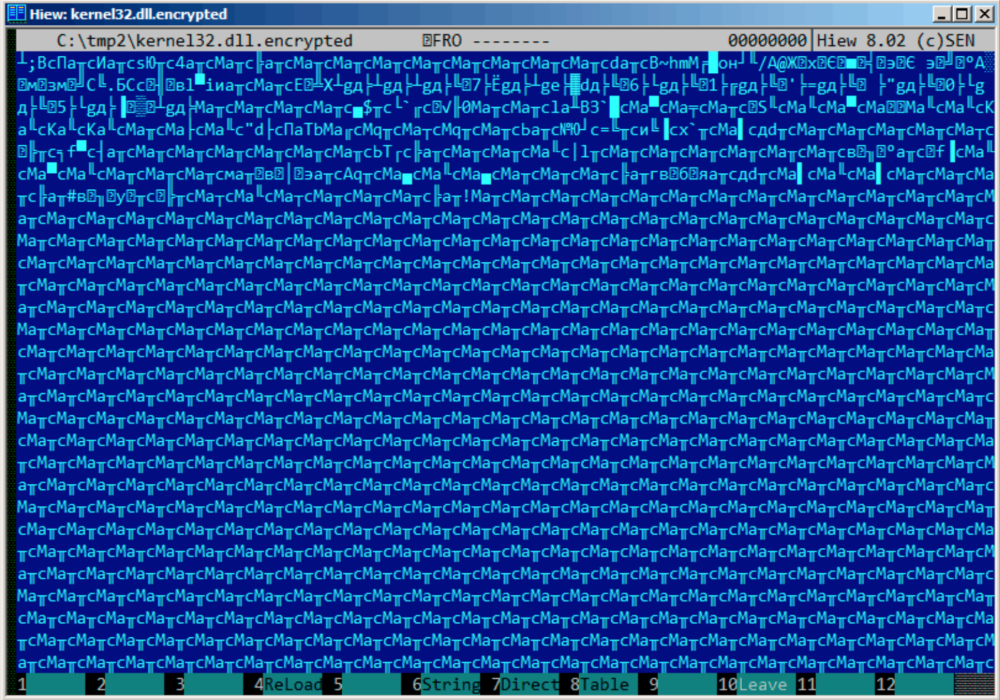
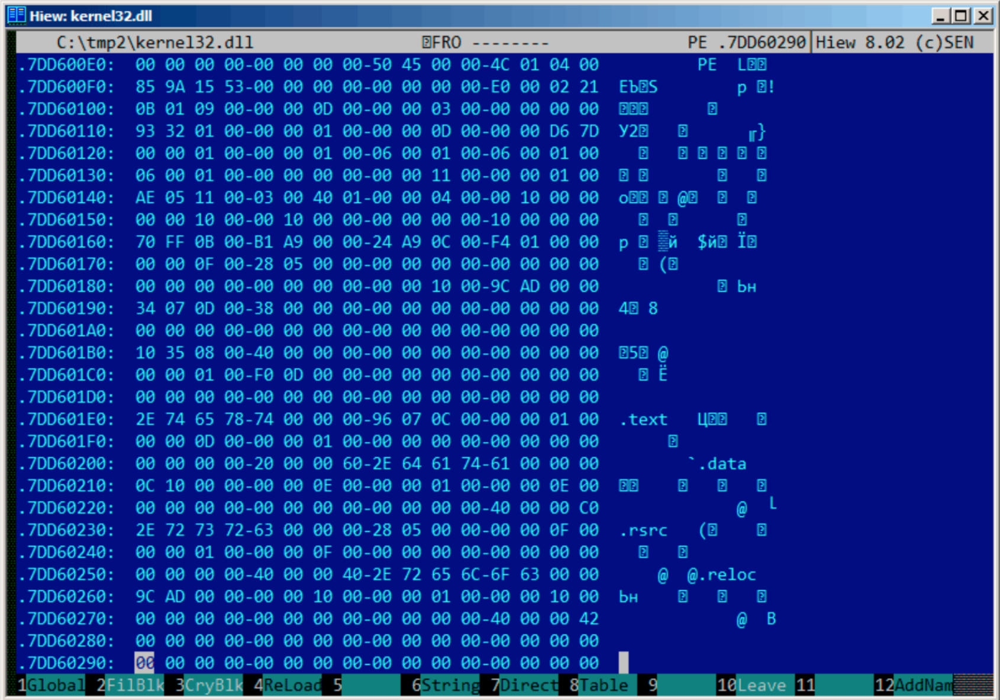

#第84章

##简单异或加密

###84.1 

Norton Guide这款工具在MS-DOS时代很受欢迎，作为超文本参考手册程序常驻在系统中。
Norton Guide的数据库文件扩展名是.ng，内容看上去是加密的：


为什么我说内容是加密的而不是压缩的呢？可以看到，0x1A字节(看起来是“→”)经常出现，而在压缩文件中不会有这种情况,所以这是个加密文件。同时我们也发现大段只包含拉丁字母的部分，看上去就像未知语言的字符串。

0x1A字节出现得频率很高，我们可以尝试解密这个文件，先假设它是用最简单的异或加密。如果我们用0x1A和Hiew中的每个字节异或，我们就能看见熟悉的英文字符串：



与单个固定字节异或是最简单的可能的加密方法，有时可能会碰到。

现在我们理解了为什么0x1A出现的频率如此高了：因为文件包含了大量0字节，加密之后替换成了0x1A。

但是常量可能会不同。在这个例子中，我们可以尝试0到255之间的每一个常量，在解密文件中寻找熟悉的内容，256就不行了。

更多关于Norton Guide文件格式内容：[ http://go.yurichev.com/17317]( http://go.yurichev.com/17317)

###84.1.1 熵

像这样简单的加密系统一个很重要的特性就是加密/解密块的信息熵是一样的。下面是我用 Wolfram Mathematica 10的分析。

```
In[1]:= input = BinaryReadList["X86.NG"];
In[2]:= Entropy[2, input] // N
Out[2]= 5.62724
In[3]:= decrypted = Map[BitXor[#, 16^^1A] &, input];
In[4]:= Export["X86_decrypted.NG", decrypted, "Binary"];

In[5]:= Entropy[2, decrypted] // N
Out[5]= 5.62724
In[6]:= Entropy[2, ExampleData[{"Text", "ShakespearesSonnets"}]] // N
Out[6]= 4.42366
```
我所做是加载文件，获取它的熵，解密保存之后再次获取它的熵(竟然是一样的！)。Mathematica也提供一些著名了英文文本来分析。所以我获取了莎士比亚十四行诗的熵，它很接近我们所分析的文件。我们分析文件包含了英文句子，和莎士比亚十四行诗的语言接近。使用了异或的英文文本有相同的熵。

然而当文件使用大于一个字节来异或时就不可信了。

我们分析的文件可以在这里下载到[http://go.yurichev.com/17350](http://go.yurichev.com/17350)

####关于熵的基数多说一点

Wolfram Mathematica使用e(自然对数)为基数计算，UNIX的[ent](http://www.fourmilab.ch/random/)工具使用2为基数。所以我在熵命令中将2设为基数，所以Mathematica获得的结果和ent一样。

###84.2 最简单4字节异或加密

如果异或加密的时候使用了更长的模式，比如，4字节模式，那么也很容易发现。下面这个例子是kernel32.dll文件的起始部分(Windows Server 2008 32位版本)：



下面是使用4字节密钥“加密”的结果：



容易发现有四个字符重复出现。事实上，PE文件头有许多0字节填充区，这也是密钥能被看出来的原因。

下面是十六进制形式PE头的开头：



下面是“加密”后：


容易发现密钥是这四个字节：8C 61 D3 63 . 使用这个信息解密整个文件很容易。因此记住PE文件的这些特性是很重要的：1）PE头有许多0字节填充区；2）每页有4096字节，所有的PE区段用0补齐，经常可以看到所有的区段后出现很长的0字节填充区。

一些其他的文件格式可能包含长0字节填充区，对于科学和工程软件文件来说非常典型。

想自己分析这些文件可以到这里下载：[http://go.yurichev.com/](http://go.yurichev.com/17352)

###84.2.1 练习

作为一个练习尝试解密下面这个文件。当然，密钥已经改变。[http://go.yurichev.com/17353](http://go.yurichev.com/17353)


